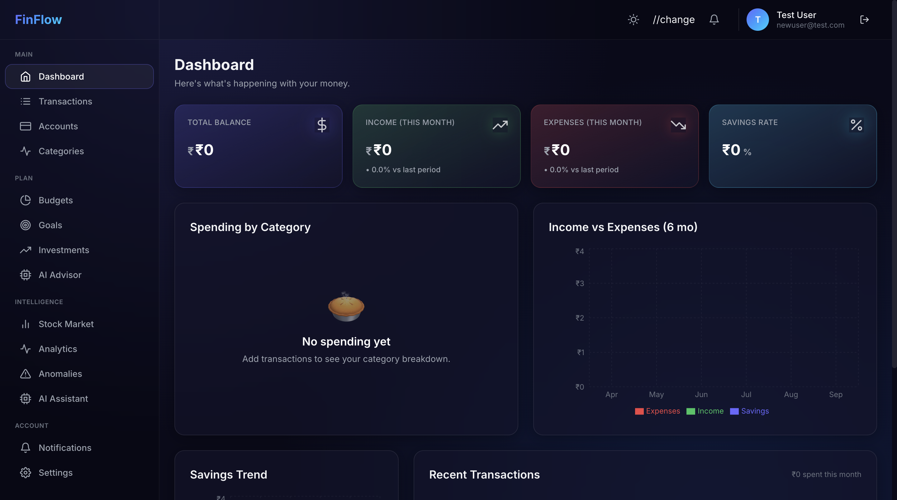
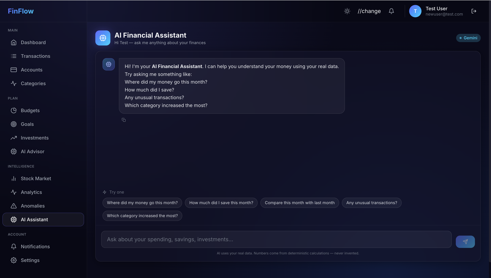
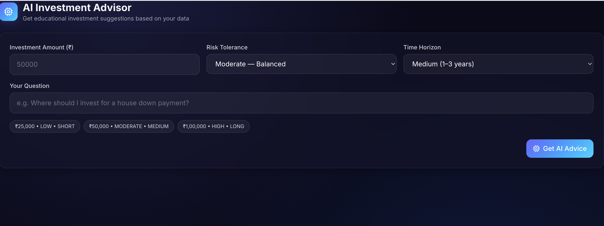
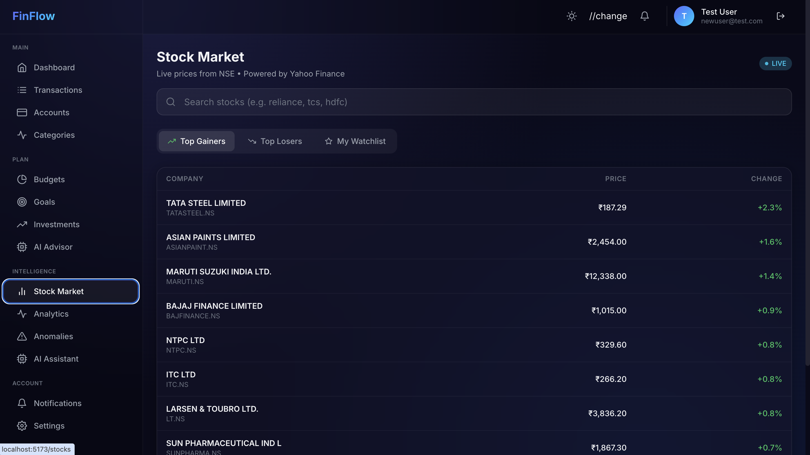

<div align="center">

# 💰 FinFlow

### Financial Intelligence & Management Platform

*A full-stack platform that transforms raw financial transactions into actionable intelligence — powered by Spring Boot, React, and Google Gemini AI.*

[](https://openjdk.org/)
[](https://spring.io/projects/spring-boot)
[](https://react.dev/)
[](https://www.mysql.com/)
[](https://tailwindcss.com/)
[](https://ai.google.dev/)

[Features](#-key-features) • [Demo](#-screenshots) • [Architecture](#-architecture) • [Setup](#-getting-started) • [API](#-api-reference)

</div>

---

## 📖 Overview

**FinFlow** is a production-grade financial intelligence platform that goes beyond basic expense tracking. It ingests your transactions, computes deterministic analytics, detects anomalies, tracks live stock markets, and uses LLMs to explain — **never invent** — what's happening with your money.

Built as a real, deployable product demonstrating:
- 🏗️ **Full-stack engineering** — Java 21 + Spring Boot 3.2 + React 18
- 🧠 **AI integration done right** — LLM explains, code calculates
- 📊 **Data science thinking** — z-score anomaly detection, trend analysis
- 🎨 **Modern UX** — glassmorphism, Framer Motion, TradingView charts
- 🔐 **Security-first** — JWT, RBAC, 33 fine-grained permissions

---

## ✨ Key Features

### 💼 Core Financial Management
- **Multi-account tracking** — Cash, Bank, UPI, Credit Card, Savings, Investment
- **Smart transactions** — Income / Expense / Transfer with auto-balance reconciliation
- **Categories** — 21 default + unlimited custom with icons and colors
- **Budgets** — period-based with progress rings and threshold alerts
- **Financial goals** — track progress, calculate required monthly savings
- **Investments** — portfolio with live P&L and allocation breakdown

### 🧠 Intelligence Engine
- **Deterministic analytics** — spending trends, category changes, cash flow
- **Explainable insights** — "Food spending increased 31% vs last month"
- **Anomaly detection** — 5 detectors (z-score, duplicate, category spike, frequency, MoM)
- **Human-readable alerts** — "₹8,500 in Shopping is 2.4σ above your average"

### 📈 Live Stock Market
- **Real-time NSE/BSE prices** via Yahoo Finance API
- **Top gainers/losers** across Nifty 50
- **Candlestick charts** with 1D/1W/1M/1Y ranges (TradingView Lightweight Charts)
- **Search** with autocomplete (e.g. "tata" → TATAMOTORS.NS)
- **Watchlist** with live price enrichment
- **5-minute cache** to respect rate limits

### 🤖 AI Financial Assistant
- **Natural language Q&A** — "Where did my money go this month?"
- **Zero hallucination** — AI only explains numbers from deterministic SQL queries
- **12-intent classifier** — routes questions to the right data source
- **Source data transparency** — every answer includes the underlying JSON
- **AI Investment Advisor** — structured output: FACTS / CALCULATIONS / SUGGESTIONS / RISKS
- **Educational only** — never promises returns, always disclaims

### 🎨 Modern UX
- **Dark-first glassmorphism** design system
- **Animated counters** for all financial numbers
- **Responsive** layout (sidebar drawer on mobile)
- **Skeleton loaders** for every async state
- **Toast notifications** for all actions
- **Theme toggle** (dark ↔ light)

---

## 📸 Screenshots

### Dashboard

*4 KPIs with animated numbers, spending pie, monthly trends, AI insight card*

### AI Assistant

*Natural language Q&A with markdown, typing indicator, expandable source data*

### AI Investment Advisor

*Structured output: Facts / Calculations / Suggestions / Risks*

### Stock Market

*Live NSE prices, top gainers/losers, search with autocomplete*

### Stock Detail

*Candlestick chart with 1D/1W/1M/1Y ranges*

### Transactions

*Full CRUD with filters, pagination, and optimistic updates*

### Analytics

*Insights, category changes, trends across 3M/6M/1Y*

### Login

*Animated gradient blobs + glassmorphism card*

---

## 🏗️ Architecture

```
┌─────────────────────────────────────────────────────────┐
│                    REACT FRONTEND                       │
│  Vite • Tailwind • Zustand • React Query • Framer       │
└──────────────────────┬──────────────────────────────────┘
                       │ HTTPS / REST / JWT
                       ▼
┌─────────────────────────────────────────────────────────┐
│                  SPRING BOOT BACKEND                    │
│                                                         │
│  Controllers → Services → Repositories → JPA            │
│                                                         │
│  ┌──────────────────────────────────────────────────┐  │
│  │  Security Layer (JWT + RBAC + 33 permissions)   │  │
│  └──────────────────────────────────────────────────┘  │
│  ┌──────────────────────────────────────────────────┐  │
│  │  Analytics Engine (deterministic SQL)            │  │
│  └──────────────────────────────────────────────────┘  │
│  ┌──────────────────────────────────────────────────┐  │
│  │  Anomaly Detector (5 statistical detectors)      │  │
│  └──────────────────────────────────────────────────┘  │
│  ┌──────────────────────────────────────────────────┐  │
│  │  AI Service (intent → data → Gemini explain)     │  │
│  └──────────────────────────────────────────────────┘  │
└──────┬──────────────────────────┬───────────────────────┘
       │                          │
       ▼                          ▼
┌─────────────┐         ┌──────────────────┐
│   MySQL 8   │         │  Yahoo Finance   │
│             │         │  Google Gemini   │
└─────────────┘         └──────────────────┘
```

### Design Principles

| Principle | Implementation |
|-----------|---------------|
| **Deterministic first** | All numbers come from SQL. AI only *explains*. |
| **Ownership checks** | Every resource access validates the owner. |
| **No float for money** | `BigDecimal(19,2)` everywhere. |
| **JWT + RBAC** | Stateless auth, method-level `@PreAuthorize`. |
| **Audit trail** | `created_at`, `updated_at`, soft-delete on all entities. |
| **Cache smartly** | Caffeine for stock data (5 min TTL). |
| **Graceful degradation** | AI fallback when Gemini is unavailable. |

---

## 🛠️ Tech Stack

### Backend
| Tech | Version | Purpose |
|------|---------|---------|
| Java | 21 | Language |
| Spring Boot | 3.2 | Framework |
| Spring Security | 6.x | Auth + RBAC |
| Spring Data JPA | 3.x | ORM |
| JJWT | 0.12 | JWT tokens |
| MySQL | 8.0 | Database |
| Caffeine | 3.x | In-memory cache |
| Lombok | Latest | Boilerplate reduction |
| WebFlux | 6.x | Reactive HTTP client (Yahoo/Gemini) |

### Frontend
| Tech | Version | Purpose |
|------|---------|---------|
| React | 18 | UI |
| Vite | 5 | Build tool |
| Tailwind CSS | 3.4 | Styling |
| Zustand | 4 | Client state |
| TanStack Query | 5 | Server state + caching |
| React Hook Form + Zod | Latest | Forms + validation |
| Framer Motion | 11 | Animations |
| Recharts | 2 | Dashboard charts |
| Lightweight Charts | 4 | Candlestick charts |
| Axios | 1.7 | HTTP client |
| react-hot-toast | 2 | Notifications |
| react-markdown | 9 | AI response rendering |

### Integrations
| Service | Purpose |
|---------|---------|
| Yahoo Finance | Live NSE/BSE stock data |
| Google Gemini 1.5 Flash | AI explanations |

---

## 🚀 Getting Started

### Prerequisites

```bash
Java 21+
Maven 3.9+
Node.js 18+
MySQL 8.0+
```

### 1. Clone the Repository

```bash
git clone https://github.com/YOUR_USERNAME/finflow.git
cd finflow
```

### 2. Set Up MySQL

```sql
CREATE DATABASE financial_platform;
CREATE USER 'finance_user'@'localhost' IDENTIFIED BY 'YourPassword';
GRANT ALL PRIVILEGES ON financial_platform.* TO 'finance_user'@'localhost';
FLUSH PRIVILEGES;
```

### 3. Configure Backend

Edit `backend/src/main/resources/application.properties`:

```properties
spring.datasource.url=jdbc:mysql://localhost:3306/financial_platform
spring.datasource.username=finance_user
spring.datasource.password=YourPassword

jwt.secret=YOUR_128_CHAR_HEX_SECRET_HERE
gemini.api-key=YOUR_GEMINI_API_KEY
```

Get a free Gemini key: https://aistudio.google.com/app/apikey

### 4. Run Backend

```bash
cd backend
./mvnw spring-boot:run
```

Backend starts at `http://localhost:8080/api`

**On first run, it auto-seeds:**
- ✅ 33 permissions
- ✅ 3 roles (ADMIN, USER, LIMITED_DASHBOARD)
- ✅ 21 default categories

### 5. Run Frontend

```bash
cd frontend
npm install
cp .env.example .env    # edit VITE_API_BASE_URL if needed
npm run dev
```

Frontend starts at `http://localhost:5173`

### 6. Create Your Account

Open `http://localhost:5173` → Register → Start adding transactions.

---

## 📚 API Reference

### Authentication

| Method | Endpoint | Description |
|--------|----------|-------------|
| POST | `/auth/register` | Create account |
| POST | `/auth/login` | Login → JWT |
| POST | `/auth/refresh` | Refresh token |
| GET  | `/auth/me` | Current user |
| POST | `/auth/logout` | Logout |

### Core Resources

| Resource | Endpoints |
|----------|-----------|
| Accounts | `GET/POST/PUT/DELETE /accounts` |
| Categories | `GET/POST/PUT/DELETE /categories` |
| Transactions | `GET/POST/PUT/DELETE /transactions` (paginated) |
| Budgets | `GET/POST/PUT/DELETE /budgets` |
| Goals | `GET/POST/PUT/DELETE /goals` + `PATCH /goals/{id}/progress` |
| Investments | `GET/POST/PUT/DELETE /investments` |
| Dashboard | `GET /dashboard` |
| Analytics | `GET /analytics/summary` + `/range` + `/months/{n}` |
| Anomalies | `GET /anomalies` + `POST /anomalies/scan` + `PATCH /{id}/review` |

### Stock Market

| Method | Endpoint | Description |
|--------|----------|-------------|
| GET | `/stocks/quote/{symbol}` | Live quote |
| GET | `/stocks/chart/{symbol}?range=1mo` | Historical chart |
| GET | `/stocks/search?q=tata` | Search |
| GET | `/stocks/gainers` | Top gainers (Nifty 50) |
| GET | `/stocks/losers` | Top losers |
| GET/POST/DELETE | `/watchlist` | Watchlist CRUD |

### AI

| Method | Endpoint | Description |
|--------|----------|-------------|
| POST | `/ai/ask` | Natural language Q&A |
| POST | `/ai/advise` | Investment advisor |
| GET  | `/ai/samples` | Sample questions |

---

## 🔐 Security

| Layer | Implementation |
|-------|---------------|
| Authentication | JWT (HS384) with refresh tokens |
| Password hashing | BCrypt (strength 12) |
| Authorization | Method-level `@PreAuthorize` + 33 permissions |
| Data ownership | Every query filters by `userId` |
| Input validation | Bean Validation + Zod on frontend |
| SQL injection | Parameterized queries via JPA |
| CORS | Whitelist `localhost:5173` |
| Rate limiting | Ready for Bucket4j (V2) |
| Secrets | Environment variables only |

**Roles:**
- **ADMIN** — full system access
- **USER** — personal finance management
- **LIMITED_DASHBOARD** — read-only

---

## 🧪 Testing

```bash
# Backend tests
cd backend
./mvnw test

# Frontend tests (coming soon)
cd frontend
npm run test
```

---

## 🗺️ Roadmap

- [x] **MVP** — Core finance + dashboard + JWT auth
- [x] **V2** — Analytics + anomaly detection + investments
- [x] **V3** — AI assistant + stock market + advisor
- [ ] **V4** — RAG for financial education
- [ ] **V5** — Agentic AI workflows (multi-agent orchestration)
- [ ] **V6** — Organization finance (departments, projects)
- [ ] **V7** — Docker + CI/CD + cloud deploy

---

## 📂 Project Structure

```
finflow/
├── backend/                    Spring Boot application
│   ├── src/main/java/com/financial/platform/
│   │   ├── config/            Security, cache, data init
│   │   ├── controller/        REST endpoints
│   │   ├── service/           Business logic
│   │   ├── repository/        JPA repositories
│   │   ├── entity/            15 JPA entities
│   │   ├── dto/               Request/response DTOs
│   │   ├── mapper/            Entity ↔ DTO mappers
│   │   ├── security/          JWT filters, auth
│   │   ├── exception/         Global error handling
│   │   ├── integration/       Yahoo Finance + Gemini clients
│   │   └── util/              Helpers
│   └── src/main/resources/    application.properties
│
├── frontend/                   React application
│   ├── src/
│   │   ├── api/               Axios clients
│   │   ├── components/        UI + feature components
│   │   ├── pages/             16 pages
│   │   ├── layouts/           App + Auth layouts
│   │   ├── hooks/             Custom + React Query hooks
│   │   ├── store/             Zustand stores
│   │   ├── routes/            React Router
│   │   └── utils/             Formatters, constants
│   └── package.json
│
├── docs/
│   └── screenshots/           README images
│
└── README.md
```

---

## 🎯 What Makes This Different

Most student projects stop at CRUD. This one:

1. **Explains** your money, not just tracks it
2. **Detects anomalies** using statistical methods (z-score, not guessing)
3. **Integrates live market data** — real NSE stocks
4. **Uses AI responsibly** — deterministic numbers + LLM explanation
5. **Ships a real UX** — glassmorphism, animations, dark mode
6. **Enforces security** — 33 permissions, ownership checks, JWT

---

## 🤝 Contributing

This is a portfolio project but PRs are welcome. Please:
1. Fork
2. Create a feature branch
3. Follow existing code style
4. Submit a PR

---

## 📄 License

MIT License — see [LICENSE](LICENSE) for details.

---

## 👤 Author

**Your Name**
- LinkedIn: [linkedin.com/in/yourprofile](https://www.linkedin.com/in/anurag-yadav-0a51022a1/)
- Email: ay073501@gmail.com
- Portfolio: yourportfolio.com

---

<div align="center">

**⭐ If this project helped you, please give it a star!**

Built with ☕ + 🧠 + ❤️

</div>